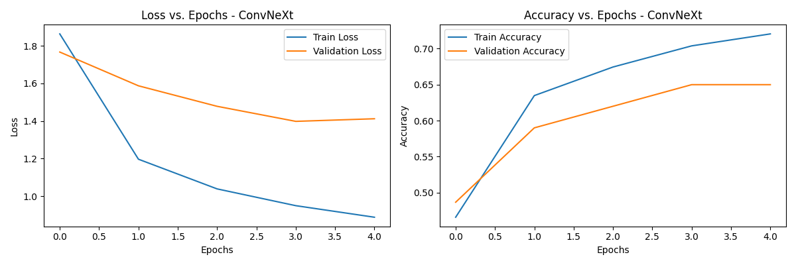

### 🌾 Wheat Disease Detection Using Deep Learning

This project focuses on detecting wheat crop diseases using state-of-the-art Convolutional Neural Network (CNN) architectures.
It leverages transfer learning with models such as ResNet50V2, ConvNeXt, and EfficientNetV2 to achieve high accuracy while maintaining efficiency on large datasets.

### 🧠 Project Overview

The model classifies wheat leaf images into 15 categories (disease and healthy classes).
A large dataset (~13k images) is used for training, validation, and testing.
The pipeline is optimized for Google Colab GPU environments with:
- Frozen base layers for faster fine-tuning
- Mixed precision training (AMP) for better speed and memory efficiency
- Learning rate scheduling and early stopping
- Automatic best model checkpointing

### 🌐 Dataset and Live App Link 
- **Dataset:** [click here for datset ](https://www.kaggle.com/datasets/kushagra3204/wheat-plant-diseases/data)
- **Live Demo:** [Try the Web App Here 🚀](https://wheat-disease-detector-dl-model-1.onrender.com/)

### ⚙️ Features

- Pretrained models from torchvision
- Layer freezing for transfer learning
- Optimized data augmentation pipeline
- GPU-based training and evaluation
- Training history and confusion matrix visualization
- Automatic best model saving and evaluation

### 📈 Results
- Accuracy: ~80% (varies by model)
- Fast training with frozen base layers
- Stable performance on large dataset

### 🧾 Requirements
- torch>=2.1.0
- torchvision>=0.16.0
- scikit-learn
- matplotlib
- seaborn
- pandas
- numpy

### 📊 Model Evaluation 

###  🧠 Model Performance

Our current CNN-based Wheat Disease Detection model achieves **~80% accuracy** on a large dataset of over **13,000 images**,  
**without any hyperparameter tuning or optimization.**

Due to limited GPU resources, this version focuses on **demonstrating feasibility and efficiency**, not peak performance.  

If selected for further development, we plan to:
- Apply **advanced hyperparameter tuning**
- Add **data augmentation & balancing**
- Use **model pruning/quantization** for faster inference
- Optimize for **real-time production deployment**

> ⚡ *Even without optimization, our model achieves around 80% accuracy — showcasing its strong potential for scalable agricultural AI solutions.*

### 🔍 Model Predictions

